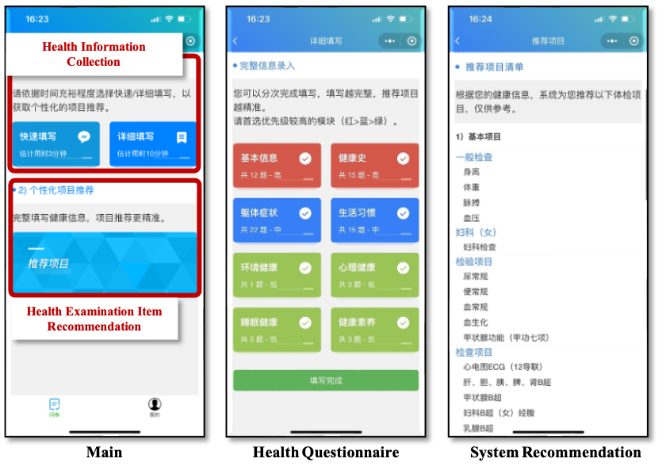
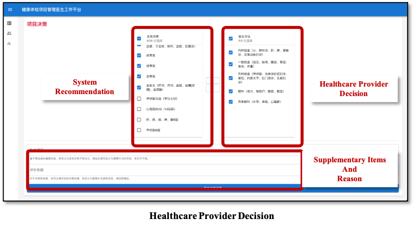

# AI-Assisted Decision Support Framework for Individualized Health Examination
## Overview

This repository provides the open-source implementation of the proposed strategy-oriented AI-assisted decision support framework and the dual-dimensional evaluation framework for individualized health examination. The repository is organized into two components:

- **Decision Support Framework**: Source code for core technical modules, workflow specifications, and functional interfaces supporting AI-assisted examination strategy development.
- **Evaluation Framework**: Analysis scripts for assessing strategy-level usability and decision-making utility.

## 📖 1. Decision Support Framework for Health Examination Strategy Development

This repository contains the core implementation of the strategy-oriented decision support framework, instantiated as the AI-IHE system. It includes key technical modules, workflow specifications, and functional interfaces for integrating heterogeneous health information, knowledge-guided reasoning, and collaborative decision support in individualized health examination strategy development.

<!-- The framework is designed to address the heterogeneity in preventive health examinations by shifting from traditional package-based approaches to a strategy-oriented, individualized decision support system. It integrates multidimensional health information (including clinical conditions and dynamic lifestyle patterns) to comprehensively characterize an individual's health status. By applying knowledge-guided clinical reasoning, it helps to support collaborative decision-making between healthcare providers and participants and develop individualized examination strategies. -->

## 📂 Repository Structure
```text
ai_ihe_decision_support_workflow/
│
├── pyproject.toml                         # Python project configuration and dependencies
├── README.md                              # Project documentation and workflow description
├── requirements.txt                       # List of required packages
│
├── ontology/                              
│   └── HEIRO.owl                          # Health Examination Item Recommendation Ontology (HEIRO)
│
├── assets/                                # Assets for project description
│
└── src/
    └── ai_ihe_core/                       # Top-level package namespace
        ├── __init__.py
        ├── data_models/                   # Data structures for health status representation
        │   ├── health_profile.py          # Comprehensive health profile
        │   └── questionnaire_info.py      # Demographics, general physical condition, medical history, lifestyle, family history and mental health
        │
        ├── health_status_representation/  
        │   ├── disease_risk_prediction/   # Deep learning-based early disease risk prediction
        │   │   ├── data_processor.py      
        │   │   └── dl_risk_model.py       
        │   │
        │   └── mhealth_behavior_analysis/ # mHealth behavior pattern extraction
        │       ├── engagement_ts_clustering.py  
        │       └── markov_behavior_trail.py     
        │
        ├── knowledge_graph/               # Knowledge graph reasoning and ontology mapping
        │   ├── heiro_mapper.py            # Maps health profiles to standardized HEIRO features
        │   └── rec_engine.py              # Neo4j property graph engine
        │
        └── pipeline/                      # Core workflow integration
            └── workflow_coordinator.py    # Pipeline coordinator
```

## 📦 Python Package Encapsulation

We have fully encapsulated the core health examination item recommendation workflow into a Python package named `ai_ihe_core`. This allows seamless integration or distribution across different clinical or research environments.

You can install the package locally in editable mode for development and testing:

```bash
pip install -e .
```

Once installed, the core modules can be safely imported directly into any Python environment:

```python
from ai_ihe_core import IndividualizedHealthExaminationPipeline
```

## ⚙️ Decision Support Workflow

The framework's decision support workflow follows a structured `input-processing-output` pipeline:

### 1. Individual Heterogeneity Health Information Collection

The AI-IHE framework needs to collect information on clinical conditions, health surveys, historical health examination records, and health management traces of examination participants for subsequent processing and the development of individualized examination strategies.

### 2. Multidimensional Health Status Representation (`ai_ihe_core.data_models.health_profile`)

The framework transforms heterogeneous real-world health information into standardized health status represenation. This integration relies on four main components:

* **Structure Information Standardization (`ai_ihe_core.data_models.questionnaire_info`):** Demographic data, general physical conditions, mental health status, lifestyle, and medical/family history collected via questionnaires are standardized by ontology mapping.

* **Early Diseases Prediction  (`ai_ihe_core.health_status_represenation.disease_risk_prediction`):** Analyzes longitudinal historical health examination records using a Multi-Feature Map Integrated Attention Deep Learning model to predict diseases risks.

* **Health Behavior Patterns Recognition (`ai_ihe_core.health_status_represenation.mhealth_behavior_analysis`):** Extracts temporal engagement trends and multidimensional behavioral trajectories from mHealth usage logs using Time-Series Similarity (DTW) and Markov Chain modeling.

* **HEIRO Ontology Mapping  (`ai_ihe_core.knowledge_graph.heiro_mapper.py`):** The comprehensive health status representation is explicitly mapped to the `Health Examination Item Recommendation Ontology (HEIRO)`. This standardizes heterogeneous health data, combining dynamic lifestyle patterns with objective clinical conditions.

### 3. Knowledge-Guided Reasoning (`ai_ihe_core.knowledge_graph.rec_engine.py`)

The framework utilizes a Neo4j **Property Graph** to conduct clinical reasoning. By evaluating the standardized health features against clinical guidelines and expert consensus stored in the knowledge base, the engine matches the optimal examination items (classified into Physique, Laboratory, and Instrument items). Furthermore, it outputs **interpretable reasoning pathways** to explain the rationale behind each recommendation.

### 4. Multi-end Collaborative Decision-Making 

**AI-IHE is a supportive system framework, not a replacement for professional clinical judgment.**

Rather than directly producing a finalized strategy, the AI-developed candidate strategy and its interpretable reasoning pathways are delivered through a multi-end collaborative decision support platform.

* **Healthcare Provider Review:** Healthcare providers review the recommended examination items alongside their corresponding health features.


* **Refinement & Negotiation:** Providers refine the strategy based on their clinical judgment and discuss it with the participant.


* **Finalization:** The final individualized health examination strategy is confirmed through shared decision-making between the healthcare provider and the participant.


## 🌐 Decision Support System Platform

The decision support system platform is currently deployed. The **Health Examination Participant's End** is displayed and  researchers can experience the interaction and strategy-finalization process by scanning the QR code below:




The **Healthcare Provider's End** of this platform is deployed within the hospital's internal network. We provides screensnap view of the website.



<!-- # Evaluation of AI-Assisted Decision Support Framework for Individualized Health Examination
 -->


## 📌 2. Dual-Dimensional Evaluation Framework for Strategy-Oriented AI-assisted Decision Support 

This repository contains the source code for the **Dual-Dimensional Evaluation Framework** presented in the manuscript *"Development and Evaluation of an AI-Assisted Decision Support Framework for Individualized Health Examination"*. 

The codebase implements a comprehensive analytical pipeline to evaluate both **Strategy-level Usability** and **Decision-making Utility** of the AI-IHE system.

<!-- The evaluation is divided into two primary dimensions: -->
1. **Strategy-level Usability:** Compares the clinical appropriateness of AI-developed strategies against Package-based strategies using an expert-defined reference standard.
2. **Decision-making Utility:** Evaluates whether AI assistance improves the quality (precision, recall) and efficiency (time) of clinical decision-making across healthcare providers with varying levels of experience.

## 📂 Repository Structure
```text
ai_ihe_dual_dimension_evaluation/
├── data/
│   ├── raw/                 # Raw evaluation records (reviews, decisions, timestamps)
│   └── processed/           # Processed datasets (e.g., Expert Gold Standard)
├── results/
│   ├── tables/              # Exported CSV tables
│   └── figures/             # Exported visualization charts
├── src/
│   ├── utils.py                           # Core statistical and metric calculation functions
│   ├── 01_establish_ref_standard.py       # Consensus processing for reference standard
│   ├── 02_strategy_usability.py           # Dimension 1: Usability metrics pipeline
│   ├── 03_decision_utility_quality.py     # Dimension 2: Decision support utility quality metrics & Visualizations
│   └── 04_decision_utility_efficiency.py  # Dimension 2: Decision support utility efficiency (Time) metrics
├── requirements.txt         # Python dependencies
└── README.md                # Project documentation
└── .gitignore               # Git ignore file type
```

## 🚀 Reproducibility
**Data Privacy Note:** The original evaluation data involves identifiable health information and cannot be shared publicly due to privacy regulations.

**Code Access:** To ensure complete methodological transparency and code reproducibility for peer review, all scripts used for evaluation experiments analysis are open sourced, any questions about the AI-assisted Individual Health Examination Decision Support System can be requested from the authors of the paper.

## 📊 Execution Pipeline
Step 1: Establish the Expert-Defined Reference Standard

Processes the independent expert reviews and consensus decisions to establish the reference standard.
```bash
# Execute the analytical modules sequentially under the project root directory
python -m src.01_establish_ref_standard
```
*Outputs:* ``data/processed/gold_standard.csv``

Step 2: Strategy-level Usability

Calculates and compares the Precision and Recall of AI-developed vs. Package-based strategies
```bash
python -m src.02_strategy_usability
```
*Outputs:* ``results/tables/table_usability.csv``

Step 3: Decision Support Utility (Quality)

Performs paired analysis of healthcare provider decisions (Manual vs. AI-assisted) across item categories and provider roles.
```bash
python -m src.03_decision_utility_quality
```
*Outputs:* ``results/tables/table_decision_utility_quality.csv``, ``results/figures/confusion_matrix.png``, ``results/figures/individual_metrics.png``

Step 4: Decision Support Utility (Efficiency)

Calculates the reduction in time required for examination strategy development under AI assistance.
```bash
python -m src.04_decision_utility_efficiency
```
*Outputs:* ``results/tables/table_decision_utility_efficiency.csv``
